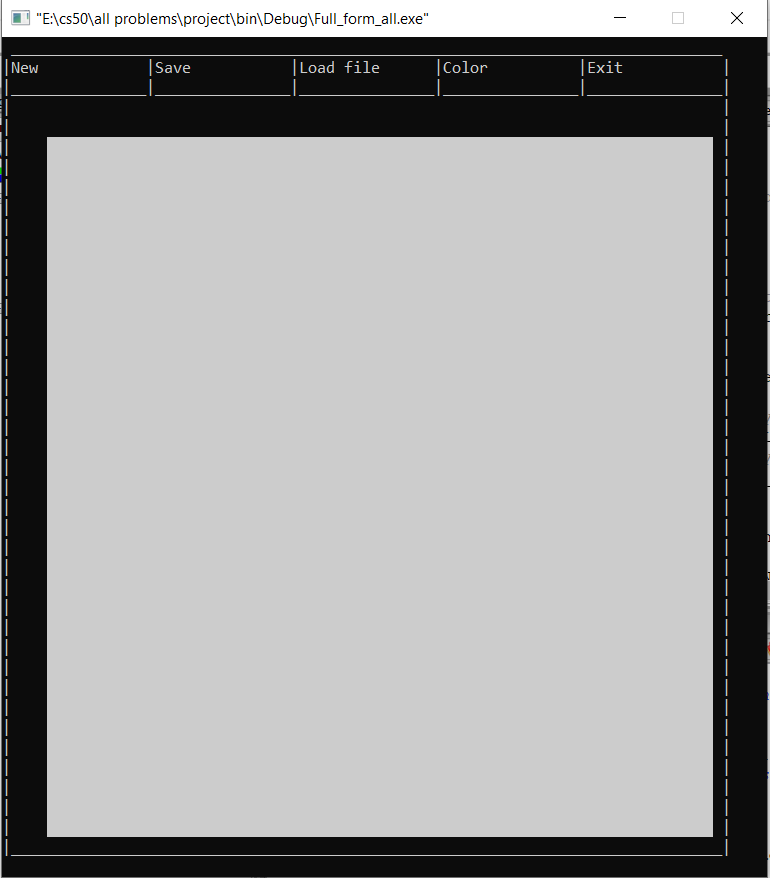
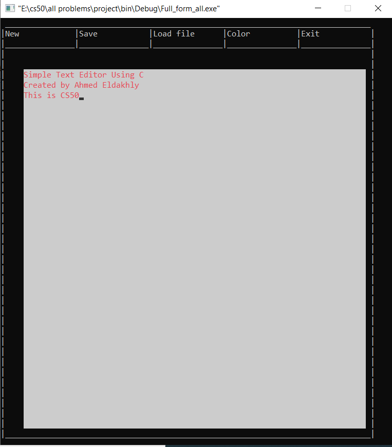
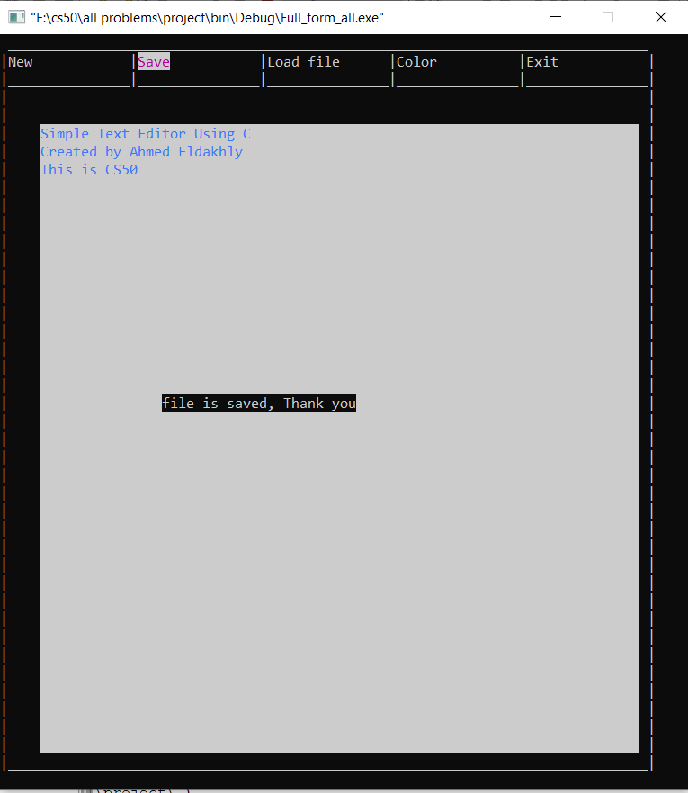
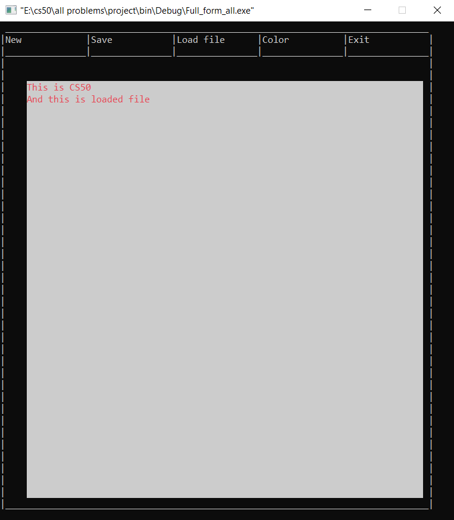
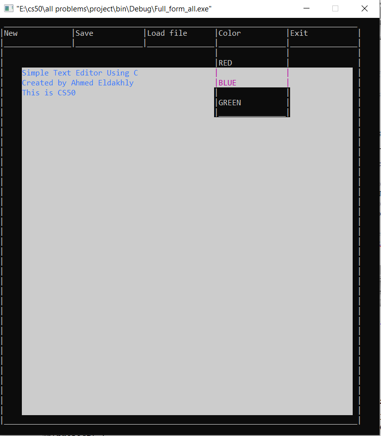
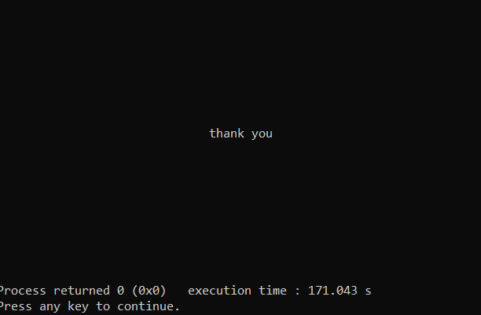
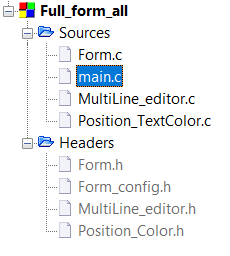

# Command Line based text editor

## Created by Ahmed Eldakhly.
            
#

# Repository Link.
[Command Line based text editor](https://github.com/Ahmed-Eldakhly/Simple_word_program_with_C)

#

# Operations with Photos

## Run the application.
Using Full_form_all.exe file.


Now The application will work with six main functions and we can navigate with tab button.



#

# Main Functions.

## 1 - Write inside the text area.
we can write what we want and use some function keys:

a - delete current char by "delete" buttom.

b - home to go to the start of the line.

c - end to go to the end of the line.

d - backspace to delete pervious char.

e - enter to go to the next line.

f - arrow to go up and down between lines or left and right in the same line.



## 2 - New.
Clear the text Area.


## 3 - Save.
Save current text in a file called SaveFile.



## 4 - Load file.
Get data from the SavedFile file and display it in the text area to modify it.



## 5 - Color.
To change the text color from list of 3 colors (RED - BLUE - GREEN).



## 6 - Exit.
Terminate the Application.



#

# Project files tree.



#

# Project files arrangement.

## Two main folders:

    Source files:
        Form.c
        main.c
        MultiLine_editor.c
        Position_TextColor.c
    
    Headers files
        Form.h
        Form_config.h
        MultiLine_editor.h
        Position_Color.h


# 

# Sample of codes.
Sample for Bash shell script files.
```
     /* pointer to shift line. */
    char* shift_Line_arr;
    /* pointer to hold the end position of the shifted line. */
    char* shift_End_of_Line;
    /* pointer to hold the current position of the shifted line. */
    char* shift_Current_Position;
    /* pointer to hold the start position of the shifted line. */
    char* shift_Start_position;
    /* pointer to point into the End of the shifted line. */
    char* shift_End_position;
    /* pointer to point into the end of the shifted line. */
    char* shift_Terminator_position;


    /* for loop to allocate every line element in the memory if it is not allocated yet. */
    if(Line_arr == NULL)
     {
        /* pointer to array for each line */
        Line_arr = malloc(LINE_SIZE_HER * sizeof(char*));

        /* array of pointer to point into the end character in each line. */
        End_of_Line = malloc(LINE_SIZE_HER * sizeof(char*));
        /* array of pointer to point into the cursor position of each line. */
        Current_Position = malloc(LINE_SIZE_HER * sizeof(char*));
        /* allocate the memory for every line ad initialize the addresses of used pointers. */
        for(int i = 0; i < LINE_SIZE_HER; i++)
        {
            Line_arr[i] = malloc(sizeof(char) * LINE_SIZE_VER);
            Line_Size(Xpos, Ypos + i, color_g, Line_arr[i], LINE_SIZE_VER);
            End_of_Line[i] = Line_arr[i];
            Line_arr[i][LINE_SIZE_VER - 1] = '\0';
            Start_position[i] = Line_arr[i];
            Terminator_position[i] = &Line_arr[i][LINE_SIZE_VER - 1];
            End_position[i] = &Line_arr[i][LINE_SIZE_VER - 2];
            Current_Position[i] = Line_arr[i];
        }
    }
```

#
